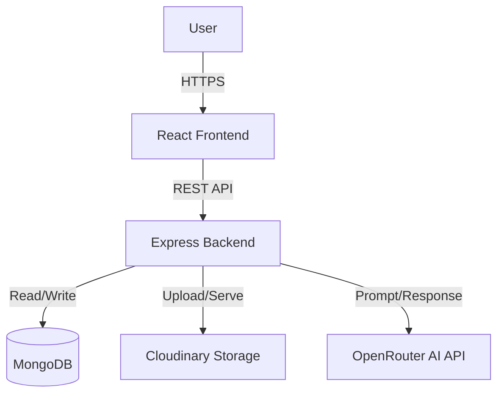
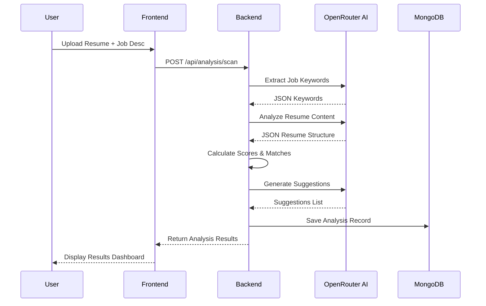

# ATS Defender - System Architecture Documentation

## 1. High-Level Overview

ATS Defender is a web application designed to help job seekers optimize their resumes for Applicant Tracking Systems (ATS). It analyzes resumes against job descriptions using AI to provide actionable feedback, scoring, and improvement suggestions.

The system follows a classic **Client-Server Architecture**:
- **Frontend**: A React-based Single Page Application (SPA) for the user interface.
- **Backend**: A Node.js/Express REST API handling business logic, data persistence, and external service integrations.
- **Database**: MongoDB for storing user profiles, analysis history, and contact messages.
- **External Services**:
    - **OpenRouter (AI)**: Powers the core analysis engine (using models like Llama 3 or Phi-3).
    - **Cloudinary**: Handles resume file uploads and storage.

---

## 2. Backend Architecture

The backend is built with **Node.js** and **Express**, providing a robust API for the frontend.

### Key Components

- **Entry Point**: `server/server.js`
    - Initializes the Express app.
    - Connects to MongoDB (`config/db.js`).
    - Sets up middleware (CORS, Body Parser).
    - Mounts API routes (`/api/auth`, `/api/analysis`, `/api/contact`).
    - Global error handling.

- **API Routes**:
    - **`routes/authRoutes.js`**: Handles user registration, login, and profile management.
    - **`routes/analysisRoutes.js`**: Core logic for resume scanning and history retrieval.
        - `POST /scan`: Triggers the analysis workflow.
        - `GET /history`: Fetches past analyses for the user.
        - `GET /:id`: Retrieves a specific analysis report.
    - **`routes/contactRoutes.js`**: Handles contact form submissions.

### Core Logic: AI Analysis Engine

The heart of the application lies in `server/utils/AIAnalyzer.js`. This utility class orchestrates the interaction with the OpenRouter AI API.

- **`AIAnalyzer` Class**:
    - **`extractJobKeywords(jobDescription)`**: Uses AI to extract required skills, preferred skills, and experience levels from the JD.
    - **`analyzeResumeContent(resumeText)`**: Parses the raw resume text into structured JSON (skills, experience, education, etc.) via AI.
    - **`calculateKeywordMatch(resumeSkills, jobKeywords)`**: Compares extracted resume skills against JD requirements to calculate a match score.
    - **`calculateSectionScores(...)`**: granular scoring for Skills, Experience, Education, and Formatting.
    - **`generateSuggestions(...)`**: Generates specific, actionable advice based on the gaps found.

### Data Models (Mongoose)

- **`User`**: specific user data, scan counts, limits.
- **`Analysis`**: Stores the full result of a resume scan, including the original text, job details, scoring results, and suggestion data.

---

## 3. Frontend Architecture

The frontend is a **React** application (built with Vite), focusing on a clean, responsive user experience.

### Key Components

- **Entry Point**: `client/src/App.jsx`
    - Configures Routing (`react-router-dom`).
    - Sets up Context Providers (`AuthProvider`, `ThemeProvider`).
    - Defines the application layout.

- **Pages**:
    - **Home**: Landing page / Dashboard.
    - **AnalysisDetailPage**: Displays the full report of a resume scan.
    - **History**: Shows a list of past scans.
    - **Auth Pages**: SignIn, SignUp.

- **Contexts**:
    - **`AuthContext`**: Manages authentication state (user user/token persistence).

---

## 4. Key Data Flows

### Resume Analysis Workflow

This is the primary function of the system.

1.  **User Action**: User uploads a resume (PDF/DOCX) and pastes a Job Description on the frontend.
2.  **Upload**: Frontend parses the text from the file (or sends file to server for parsing - *implementation details vary based on `server/middleware/upload.js`*).
3.  **Request**: Frontend sends `resumeText`, `jobDescription` to `POST /api/analysis/scan`.
4.  **Processing (Backend)**:
    - `AIAnalyzer` extracts keywords from the Job Description.
    - `AIAnalyzer` parses and structures the Resume Text.
    - Comparison logic calculates scores (Match Score, Section Scores).
    - AI generates specific suggestions.
5.  **Persistence**: Results are saved to the `Analysis` collection in MongoDB.
6.  **Response**: The complete analysis object is returned to the frontend.
7.  **Display**: Frontend renders the score gauges, keyword matches, and suggestion lists.

---

## 5. Environment Configuration

To run the system, the following environment variables are required in `.env`:

**Server**:
- `PORT`: Server port (default: 5000)
- `MONGODB_URI`: Connection string for MongoDB.
- `JWT_SECRET`: Secret key for signing JSON Web Tokens.
- `OPENROUTER_API_KEY`: API key for accessing AI models.
- `CLOUDINARY_CLOUD_NAME`, `CLOUDINARY_API_KEY`, `CLOUDINARY_API_SECRET`: For file storage.
- `CLIENT_URL`: URL of the frontend (for CORS).

**Client**:
- `VITE_API_URL`: Base URL for the backend API.
